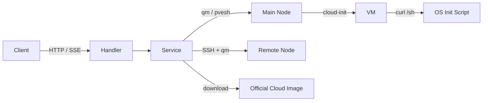

> [!NOTE]
> This README was generated by [SKILL](https://github.com/agenvoy/skill-readme-generate), get the ZH version from [here](./doc/README.zh.md).

***

<strong>ONE API CALL FROM CLOUD IMAGE TO SSH-READY VM ON PROXMOX VE!</strong>

***

> A Go Proxmox VE REST API with SSE-streamed provisioning, concurrent VMID/IP allocation, and transparent multi-node dispatch

## Table of Contents

- [Features](#features)
- [Architecture](#architecture)
- [License](#license)
- [Author](#author)

## Features

> `git clone https://github.com/pardnchiu/QemuRun-pve.git` · [Documentation](./doc/doc.md)

- **One-Call Provisioning** — A single POST downloads the official cloud image, creates the VM, imports the disk, injects cloud-init, and runs the OS init script, streaming every stage and its duration over Server-Sent Events.
- **VMID-as-IP Concurrent Allocation** — Probes the configured range from both ends in parallel, skipping IDs taken by config files, `qm config`, or a live SSH port, and uses the first free number as both VMID and last IP octet.
- **Cluster CPU Baseline Detection** — Reads CPU flags from every node, picks the lowest common x86-64 level, and caches it so VMs stay migratable across the whole cluster.
- **Transparent Multi-Node Dispatch** — Runs `qm` locally for VMs on the main node and over SSH for every other node, so callers never deal with cluster topology, including live migration with local disks.
- **Three-Layer Access Guard** — CORS admits only same-private-subnet origins, mutating calls require an `ALLOW_IPS` match, and a disabled list locks specific VMIDs out of API control.

## Architecture

> [Full Architecture](./doc/architecture.md)

## License

This project is licensed under the [AGPL-3.0 LICENSE](LICENSE).

## Author

Just [open an issue](https://github.com/pardnchiu/QemuRun-pve/issues/new) to share an idea.

***

©️ 2025 [邱敬幃 Pardn Chiu](https://www.linkedin.com/in/pardnchiu)
