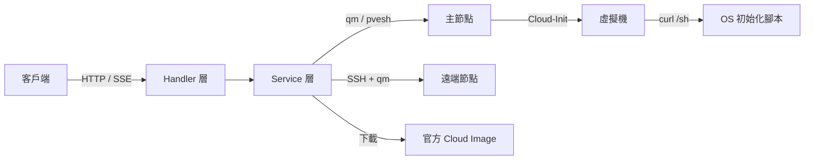

最後更新：2026-10-06

> [!NOTE]
> 此 README 由 [SKILL](https://github.com/agenvoy/skill-readme-generate) 生成，英文版請參閱 [這裡](../README.md)。

***

<strong>ONE API CALL FROM CLOUD IMAGE TO SSH-READY VM ON PROXMOX VE!</strong>

***

> Go Proxmox VE REST API，具備 SSE 全流程佈建、VMID／IP 並行配置與叢集多節點透明調度

## 目錄

- [功能特點](#功能特點)
- [架構](#架構)
- [授權](#授權)
- [Author](#author)

## 功能特點

> `git clone https://github.com/pardnchiu/QemuRun-pve.git` · [完整文件](./doc.zh.md)

- **單一呼叫完成佈建** — 從下載官方 Cloud Image、建立 VM、匯入磁碟、注入 Cloud-Init 到執行 OS 初始化腳本，一次 POST 完成，每個階段的進度與耗時以 SSE（Server-Sent Events）即時推送。
- **VMID 即 IP 的並行配置** — 在設定區間內從頭尾兩端同時並行探測，排除既有設定檔、`qm config` 與 SSH 埠占用，取第一個可用編號同時作為 VMID 與 IP 末段。
- **叢集 CPU 基準自動偵測** — 逐一讀取所有節點的 CPU flags 判定 x86-64 等級，取全叢集最低共同版本並快取，讓 VM 可在任何節點間遷移不失效。
- **多節點透明調度** — 位於主節點的 VM 直接呼叫 `qm`，其他節點自動經 SSH 轉送，呼叫端不需知道叢集拓撲，並支援帶本地磁碟的線上遷移。
- **三層存取防護** — CORS 僅放行同私有子網來源、寫入操作受 `ALLOW_IPS` 白名單限制，另可用停用清單鎖定特定 VMID 不受 API 控制。

## 架構

> [完整架構](./architecture.zh.md)

## 授權

本專案採用 [AGPL-3.0 LICENSE](../LICENSE)。

## Author

Just [open an issue](https://github.com/pardnchiu/QemuRun-pve/issues/new) to share an idea.

***

©️ 2025 [邱敬幃 Pardn Chiu](https://www.linkedin.com/in/pardnchiu)
