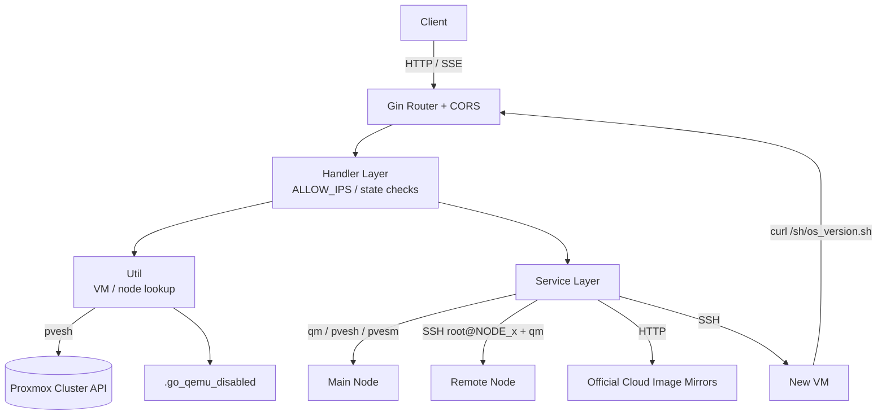
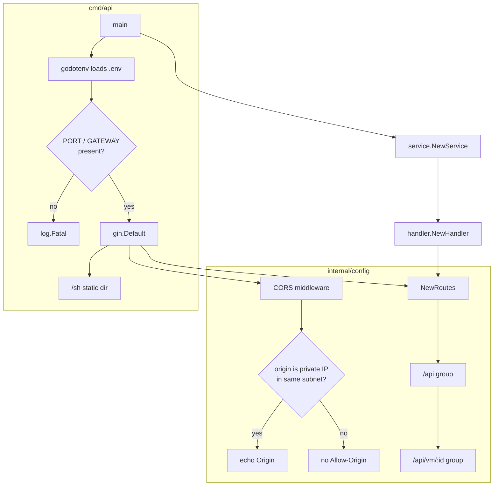
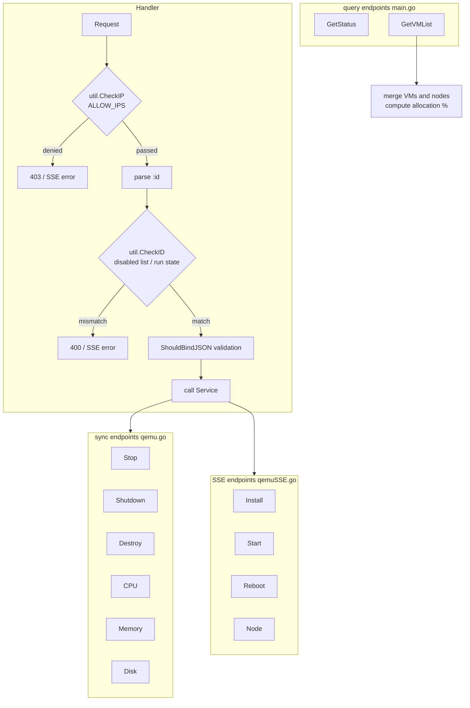
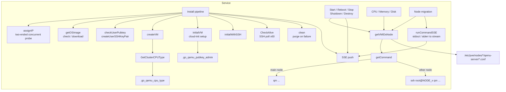
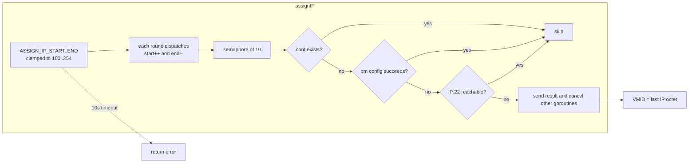
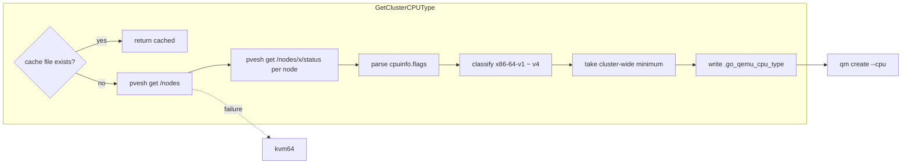
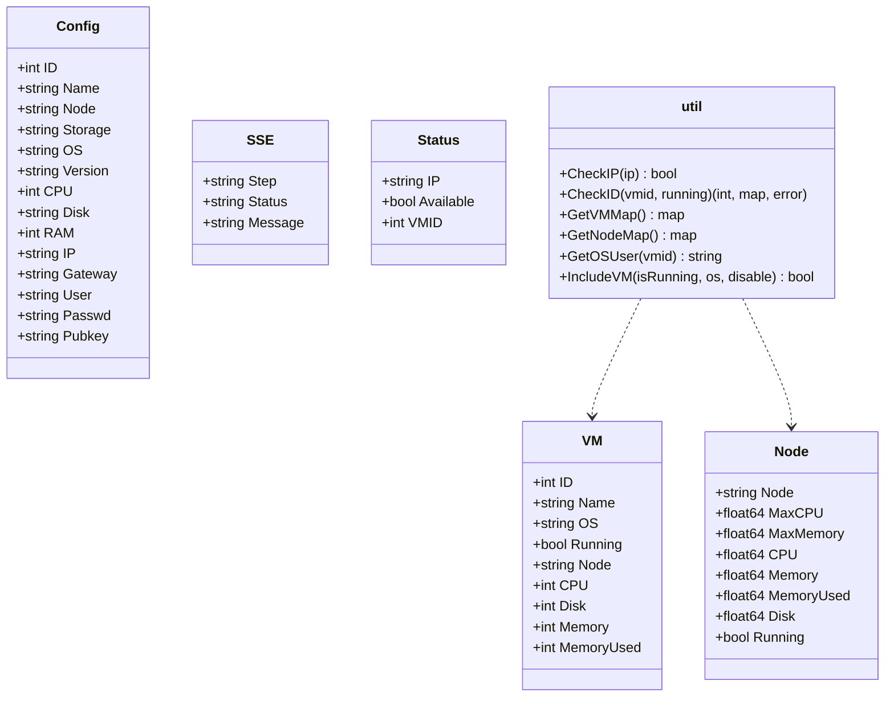
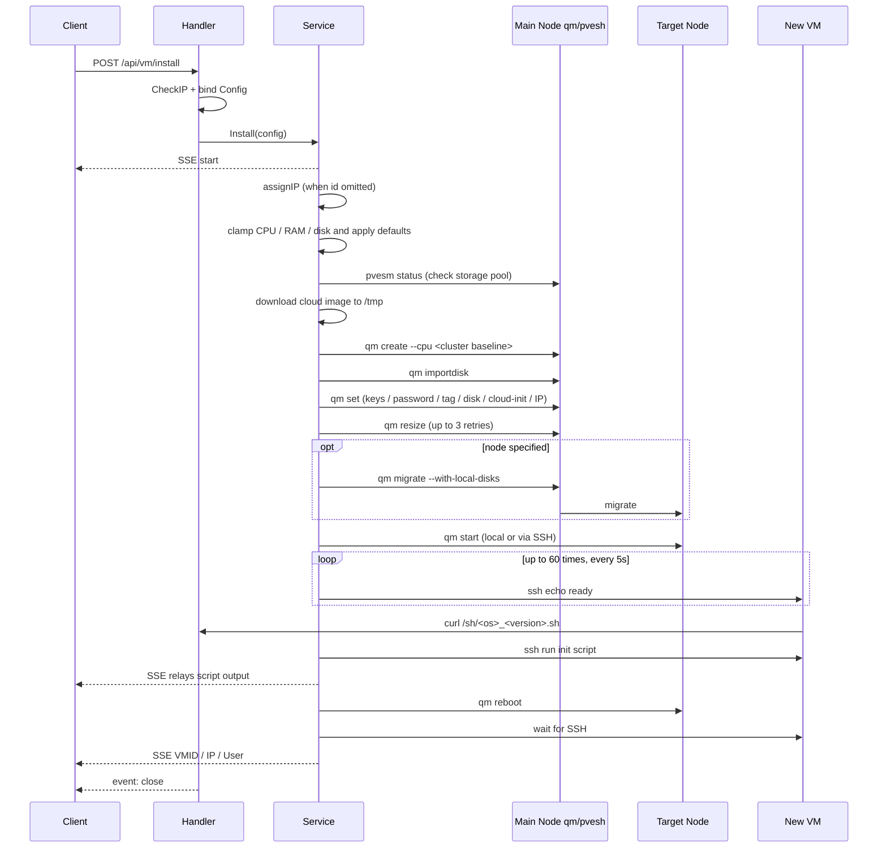
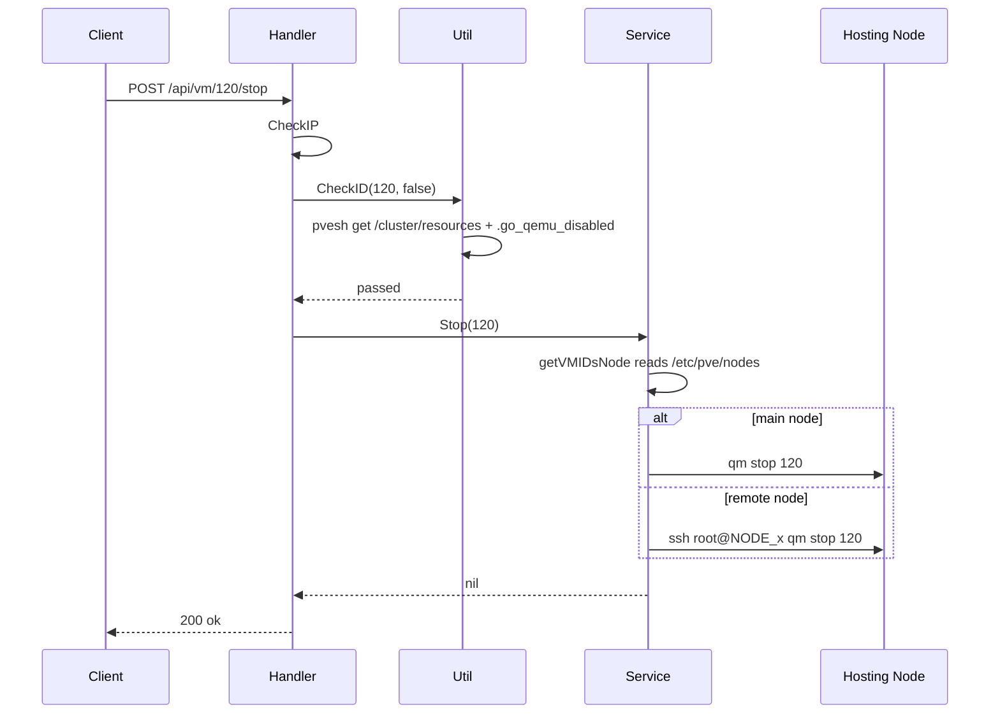
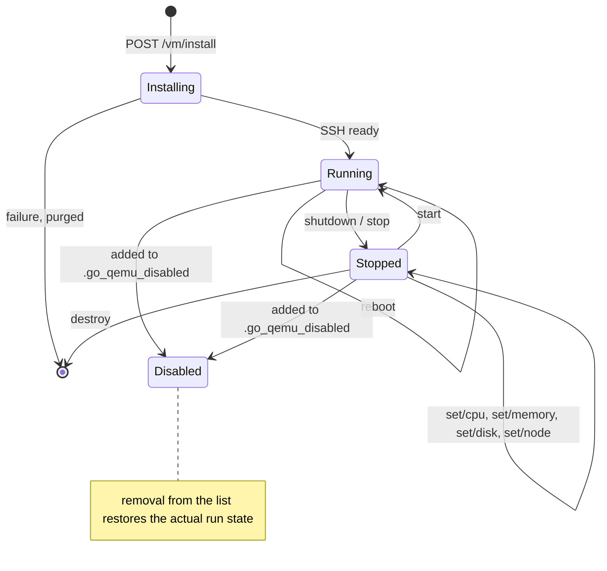

# QemuRun-pve - Architecture

> Back to [README](../README.md)

## Overview

## Module: Entry and Config (cmd/api, internal/config)

Loads environment variables, registers middleware and routes, and serves the OS init scripts as static files.

## Module: Handler (internal/handler)

Parses path params and bodies, runs access and state pre-checks, then delegates to Service; responds with plain text, JSON, or SSE depending on the endpoint.

## Module: Service (internal/service)

Wraps every `qm` / `pvesh` / `pvesm` call and owns the install pipeline, resource allocation, and multi-node command dispatch.

### VMID / IP Allocation

### Cluster CPU Baseline

## Module: Util and Model (internal/util, internal/model)

Util provides the cluster lookups and access checks shared by handlers; Model defines request, response, and SSE structures.

## Data Flow

### Create a VM

### Sync Operation (Stop)

## State Machine

### VM Lifecycle (API-triggered transitions)

***

©️ 2025 [邱敬幃 Pardn Chiu](https://www.linkedin.com/in/pardnchiu)
