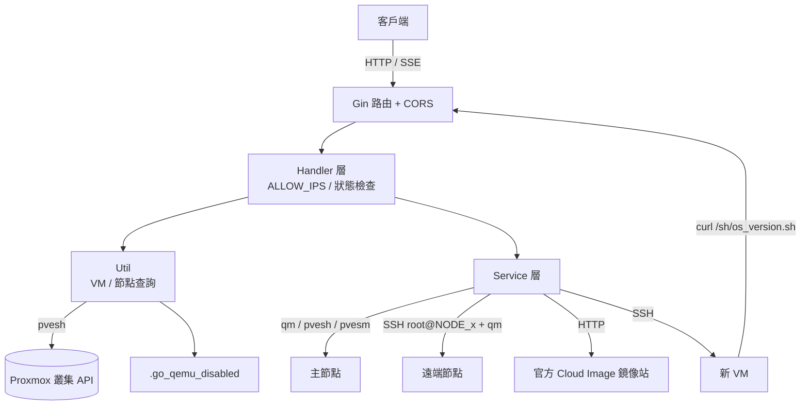
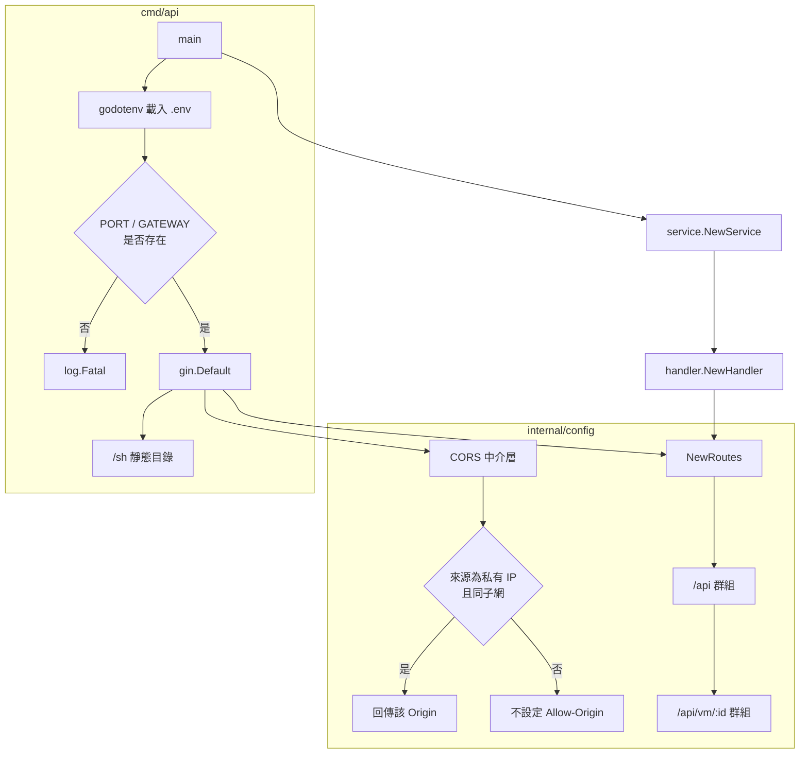
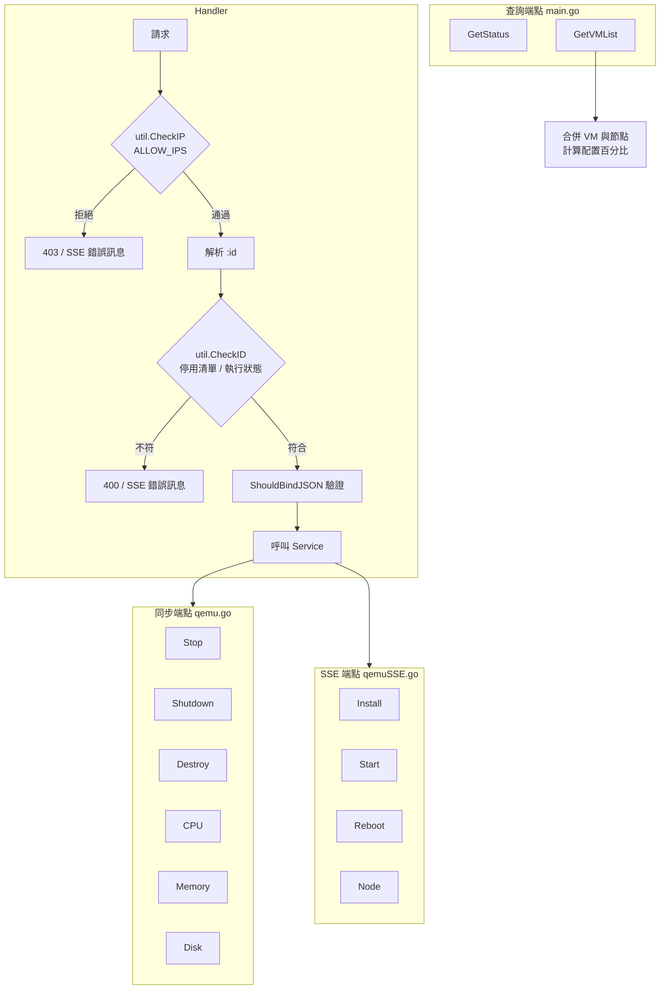
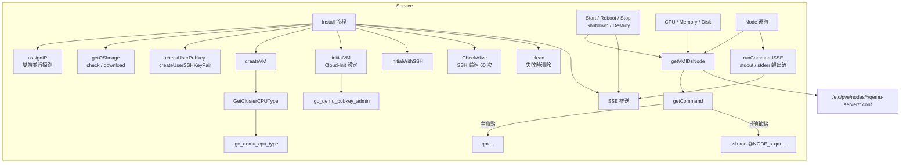
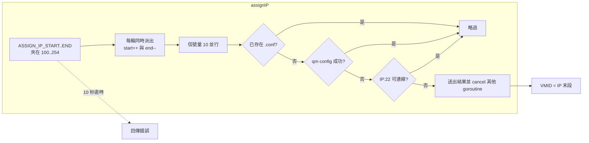
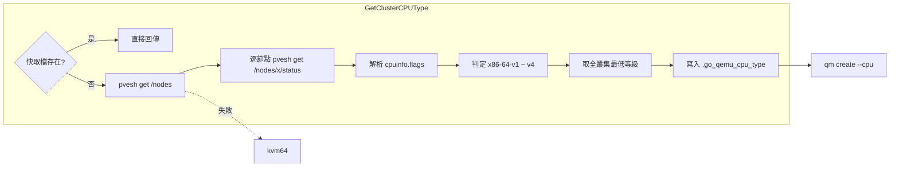
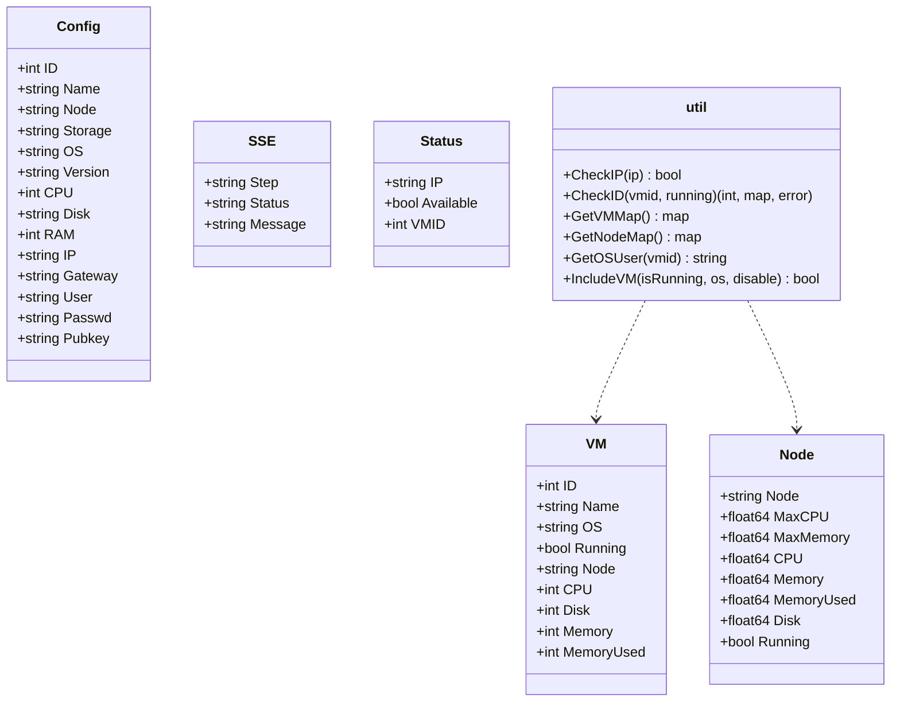
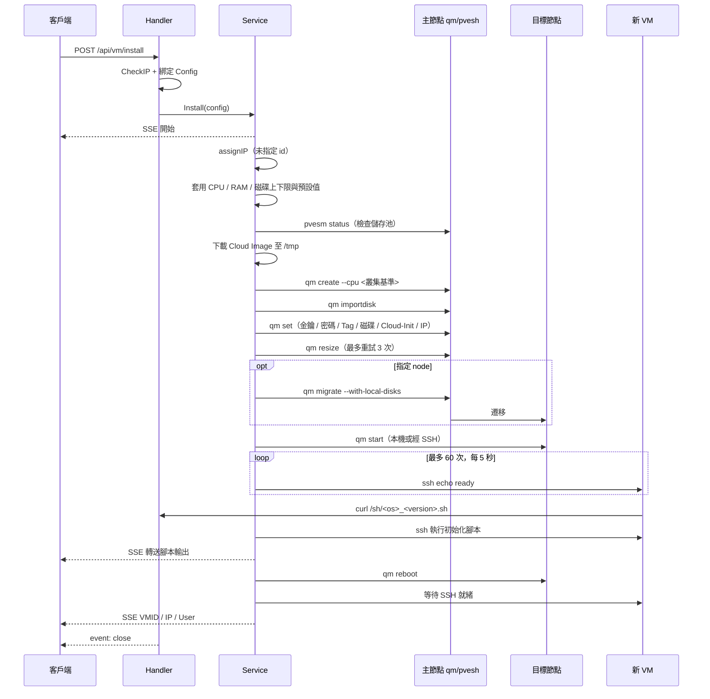
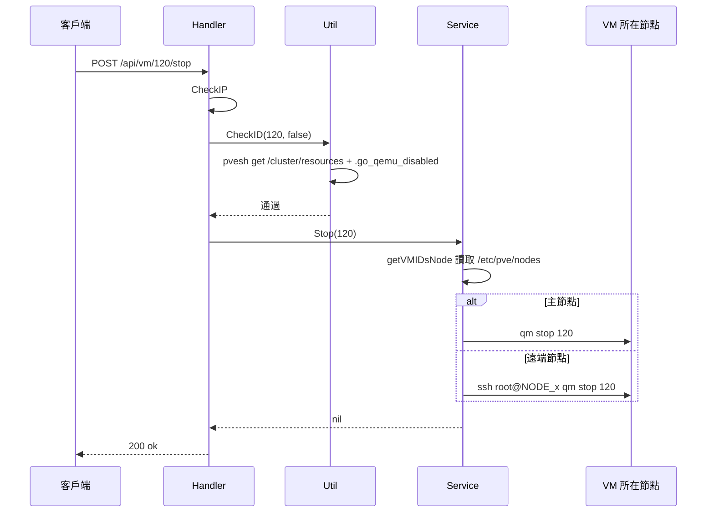
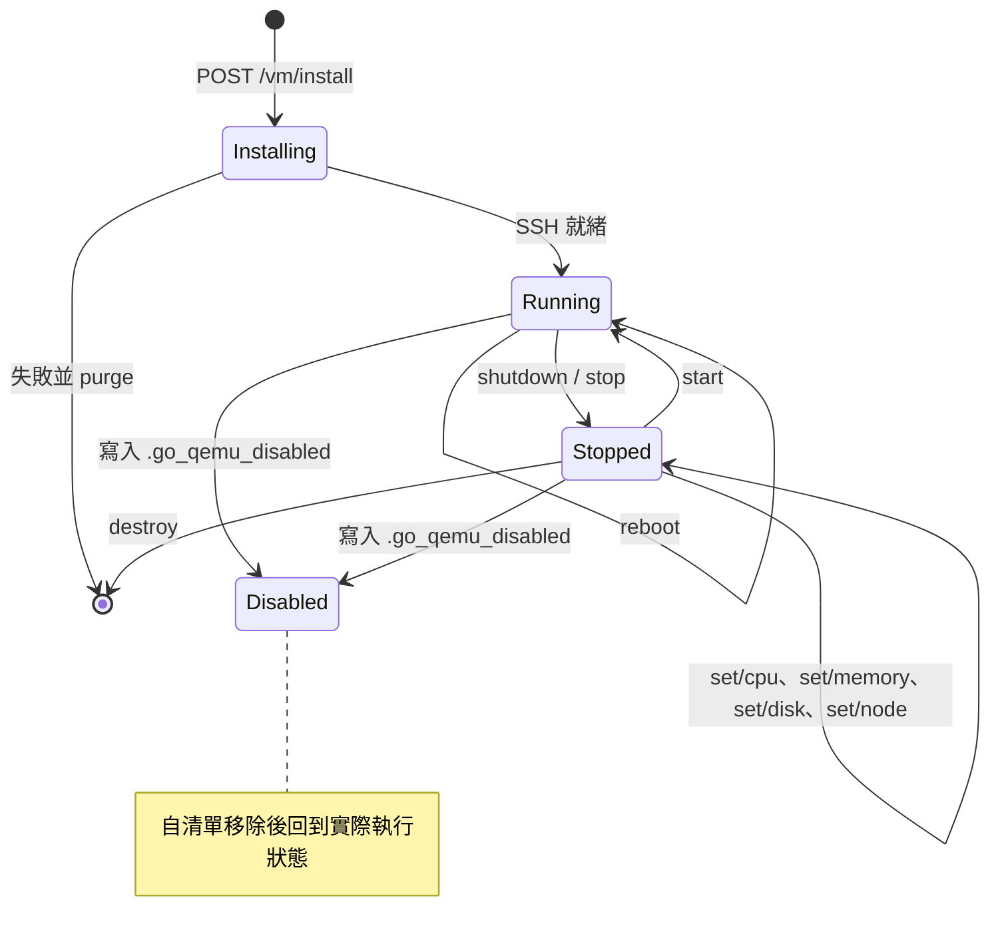

# QemuRun-pve - 架構

> 返回 [README](./README.zh.md)

## 概覽

## Module: 進入點與設定（cmd/api、internal/config）

載入環境變數、註冊中介層與路由，並以靜態路徑對外提供 OS 初始化腳本。

## Module: Handler（internal/handler）

解析路徑參數與請求內容，執行存取與狀態前置檢查後交給 Service；依端點型態回應純文字、JSON 或 SSE。

## Module: Service（internal/service）

封裝所有 `qm`／`pvesh`／`pvesm` 呼叫，負責安裝流程、資源配置與多節點指令轉送。

### VMID／IP 配置

### 叢集 CPU 基準

## Module: Util 與 Model（internal/util、internal/model）

Util 提供跨 Handler 共用的叢集查詢與存取檢查；Model 定義請求、回應與 SSE 結構。

## 資料流

### 建立 VM

### 同步操作（以 Stop 為例）

## 狀態機

### VM 生命週期（經 API 可觸發的轉換）

***

©️ 2025 [邱敬幃 Pardn Chiu](https://www.linkedin.com/in/pardnchiu)
